# SAP Integration Suite – Use Cases, Challenges, Scenarios & Solutions

---

## 1. Cloud Integration

### 📘 Scenario: Global Retail Company With Scattered Systems

The retail company uses SAP ERP on‑prem, a cloud CRM, e‑commerce apps, and warehouse tools. None of these systems talk to each other in real time.
As a result:

- Customers order items that are already out of stock.
- Warehouses overstock items due to outdated information.
- Managers cannot rely on inventory numbers.

### ❗ Challenges

- No real‑time communication between systems
- Stock mismatches (stockouts + overstocking)
- Manual entry causes human errors
- No unified visibility across the supply chain

### ✅ Solution: Cloud Integration

- Build integration flows connecting ERP ↔ CRM ↔ e‑commerce
- Trigger inventory updates instantly based on events
- Remove manual data entry using automation workflows
- Set monitoring dashboards + alerts for mismatches

**Result:** Real-time stock accuracy, happier customers, and synchronized operations.

---

## 2. API Management

### 📘 Scenario: Digital Banking APIs for Mobile Apps & Partners

A financial firm exposes APIs for transactions, account data, loan checks, etc. These APIs are accessed by:

- mobile apps
- ATM systems
- external fintech partners

If APIs are not secured, the system becomes vulnerable to fraud.

### ❗ Challenges

- Must secure APIs heavily (banking-level security)
- Handle high traffic at peak hours
- Manage permissions for internal + external users
- Need real-time monitoring for fraud/abuse

### ✅ Solution: API Management

- Implement OAuth 2.0, JWT, rate limiting
- Set role-based API access
- Auto-scale APIs for performance
- Monitor API performance & errors centrally

**Result:** Safe, scalable, and high-performance banking APIs.

---

## 3. Event Mesh

### 📘 Scenario: E-Commerce Order Fulfillment & Inventory Updates

The company has warehouses across countries. Order events take minutes/hours to sync. This causes:

- Wrong order status
- Late shipping
- Inventory inconsistencies

### ❗ Challenges

- No instant messaging between systems
- Legacy systems cannot push updates
- No alerts for low stock or order issues

### ✅ Solution: Event Mesh

- Systems publish events like **Order Created**, **Stock Updated**
- Other apps subscribe and react instantly
- Real-time notifications to customers & warehouse staff

**Result:** Faster order fulfillment, accurate stock, real-time communication.

---

## 4. Integration Advisor

### 📘 Scenario: Manufacturing Company Onboarding Dozens of Suppliers

Every supplier uses a different file format: CSV, JSON, XML, EDI.\
IT manually builds each mapping → weeks of effort.

### ❗ Challenges

- Time-consuming custom integrations
- Error-prone manual mappings
- No mapping standards → inconsistent quality

### ✅ Solution: Integration Advisor

- AI-generated mapping proposals
- Pre-built templates for supplier transactions
- Automated validation + testing

**Result:** Faster supplier onboarding with fewer errors.

---

## 5. Trading Partner Management

### 📘 Scenario: Global Retailer Handling Thousands of Supplier Orders

Suppliers send invoices & orders using email, Excel, fax, EDI.\
Leads to:

- Lost purchase orders
- Duplicate invoices
- No real-time tracking

### ❗ Challenges

- Too many communication methods
- Manual validation → slow & error-prone
- Compliance rules differ per region
- No visibility into order lifecycles

### ✅ Solution: Trading Partner Management

- Centralized B2B communication hub
- Standard templates for all partners
- Self-service onboarding portal
- Real-time order tracking dashboards

**Result:** Smooth supplier communication and faster order processing.

---

## 6. OData Provisioning

### 📘 Scenario: Sales Team Using Mobile App to Access SAP ERP Data

Sales reps need to check inventory during client visits.\
But ERP data is locked inside SAP backend.

### ❗ Challenges

- Hard to expose ERP data securely
- Need strong role-based access
- Mobile apps cannot consume complex ERP tables

### ✅ Solution: OData Provisioning

- Expose ERP data as clean OData APIs
- Mobile app shows real-time stock and price
- Secure authentication ensures proper access

**Result:** Empowered sales reps, faster order conversions.

---

## 7. Data Space Integration

### 📘 Scenario: Retailer Creating a Unified Customer Data Platform

Customer data exists in:

- CRM
- POS
- Website
- Mobile app

This results in:

- Duplicate profiles
- Inconsistent purchase history
- Poor personalization

### ❗ Challenges

- Different data formats & schemas
- Data quality issues
- Large data volume integration
- Strict privacy regulations

### ✅ Solution: Data Space Integration

- Connect all systems to a shared data environment
- Build a full 360° customer view
- Apply granular access & anonymization controls

**Result:** Better marketing, improved customer experience, single source of truth.

---

## 8. Integration Assessment

### 📘 Scenario: Retail Chain Expanding Rapidly

The company connects ERP, CRM, WMS, POS, and e-commerce manually.\
As new stores open, integrating them becomes slow and error-prone.

### ❗ Challenges

- No visibility across integration landscape
- Data inconsistencies across systems
- Manual integrations = slow scaling

### ✅ Solution: Integration Assessment

- Automated scoring of integration health
- Detect bottlenecks, failures, outdated tech
- Provide best-practice architectural recommendations

**Result:** Stable, scalable integration landscape.

---

## 9. Migration Assessment

### 📘 Scenario: Manufacturing Company Migrating ERP to Cloud

The company wants S/4HANA Cloud. But its integrations are undocumented and fragile.

### ❗ Challenges

- Unknown integration dependencies
- High risk of migration downtime
- Hard to test migrated interfaces
- Compliance risks

### ✅ Solution: Migration Assessment

- Auto-discover all integration flows
- Identify migration risks early
- Build a clear migration roadmap
- Test integrations before cutover

**Result:** Safe and predictable ERP cloud migration.

---

## 10. Migration Tooling

### 📘 Scenario: Financial Firm Migrating from SAP PI/PO to Integration Suite

Legacy SAP PI/PO systems are expensive and difficult to maintain.

### ❗ Challenges

- Manual migration too slow and risky
- No real-time tracking during migration
- Downtime impacts customer transactions

### ✅ Solution: Migration Tooling

- Automatically migrate PI/PO artifacts
- Live monitoring of migration phases
- Minimal downtime
- Ensures compliance & better performance

**Result:** Fast, low-risk migration to modern cloud integration.

## 📊 Cheat‑Sheet Diagrams

### **Cloud Integration – Real‑Time Sync (Diagram)**

### **API Management – Secure API Access**

### **Event Mesh – Event-Driven Architecture**

### **Trading Partner Management – B2B Hub**

### **OData Provisioning – Exposing ERP Data**

```mermaid
graph TD
A[SAP ERP] -- OData Service --> B[OData Provisioning]
B --> C[Mobile App]
B --> D[Third‑party Systems]
```

### **Data Space Integration – Unified Customer Data**

```mermaid
graph TD
A[CRM] --> F[Data Space]
B[E‑commerce] --> F
C[Loyalty System] --> F
D[POS] --> F
F --> E[Unified Customer View]
```

### **Migration Assessment – Move to Cloud**

### **Migration Tooling – Automated Migration**

---

## 📝 Quick Revision Notes

### **Cloud Integration**

- Connect SAP + non-SAP systems in real time.
- Best for: inventory sync, order updates, supply chain automation.
- Solve delays, mismatched data, manual updates.

### **API Management**

- Secure, scalable API exposure.
- Best for: banks, fintech, partner integrations.
- Solve security risks, high traffic, poor monitoring.

### **Event Mesh**

- Event-driven communication.
- Best for: real-time updates, notifications, order status.
- Solve delays, siloed systems, no real-time triggers.

### **Integration Advisor**

- Auto-generate mappings/interfaces.
- Best for: B2B, supplier onboarding.
- Solve slow interface creation, manual mapping errors.

### **Trading Partner Management (TPM)**

- Central B2B communication hub.
- Best for: retailers, suppliers, distributors.
- Solve fragmented communication, compliance issues.

### **OData Provisioning**

- Expose ERP data via OData for apps.
- Best for: mobile apps, dashboards.
- Solve slow access, security issues, outdated methods.

### **Data Space Integration**

- Combine data from multiple systems.
- Best for: customer 360, analytics.
- Solve data silos, inconsistent formats.

### **Integration Assessment**

- Health-check + strategy recommendations.
- Best for: large enterprises.
- Solve unknown dependencies, integration risks.

### **Migration Assessment**

- Plan migration from PI/PO.
- Solve: unclear integration landscape, high risks.

### **Migration Tooling**

- Automatically convert old PI/PO artifacts.
- Solve slow manual migration, downtime, high cost.

