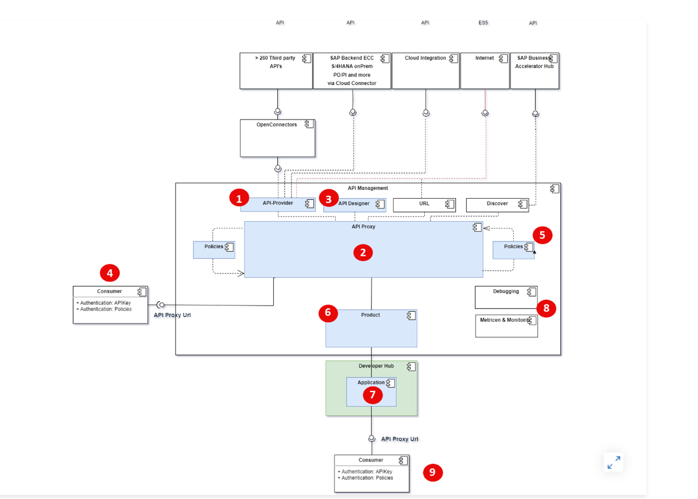
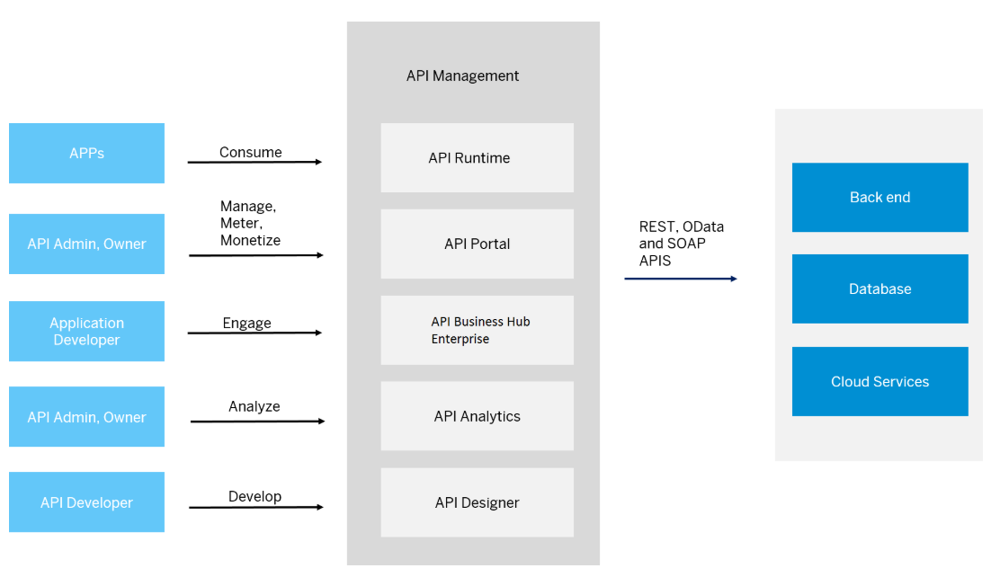

# SAP API Management – Complete, Simple Overview

## 📌 Objective
By the end of this lesson, you will clearly understand SAP API Management, its features, use cases, challenges, and the solutions it provides.

---

# 📘 Introduction to SAP API Management
SAP API Management is a powerful tool within the SAP Integration Suite that helps organizations design, secure, manage, publish, and analyze APIs throughout their lifecycle.

APIs act like digital bridges—they allow systems, apps, and services to communicate safely and efficiently. Since organizations rely heavily on real-time data flow and integrations, APIs have become **business-critical assets**.

To manage them properly, companies use **API Management**.

---

# 🔍 What is SAP API Management?
SAP API Management is a centralized platform that lets organizations:
- Create APIs
- Secure them
- Manage usage
- Apply policies
- Monitor performance
- Provide developer access

It acts like a **control center** where all APIs are governed and optimized.

---

# 🌟 Why Do We Need API Management?
Without API Management:
- APIs are difficult to discover
- No standard documentation
- Security risks increase
- No analytics on usage
- Hard to manage different versions

API Management solves all these issues by providing a **central hub** for developers, partners, and customers to find and use APIs.

---

# 🧩 Key Benefits of SAP API Management
Below is a simple and clear overview of each benefit.

## 1. 🔎 Discovery & Governance
**Challenges:**
- APIs scattered across systems
- No version control
- Missing documentation
- Hard to maintain API lifecycle

**Solutions by SAP API Management:**
- Central API directory
- Version management
- API lifecycle management (creation → publish → retirement)
- Add and manage detailed documentation

**Impact:** Easier discovery, faster onboarding, and consistency.

---

## 2. 🔐 Access & Traffic Security Policies
**Challenges:**
- Unauthorized access
- Data breaches
- No standard security enforcement
- Compliance risks

**Solutions:**
- Authentication (OAuth, API Key, etc.)
- Authorization controls
- Encryption support (HTTPS, TLS)
- Predefined security policy templates

**Impact:** Secure API traffic, safer integrations, and industry-standard compliance.

---

## 3. 🔄 Transformations & Data Graphs
**Challenges:**
- Raw backend data not suitable for frontend apps
- Need for data filtering and reshaping
- Multiple API calls required to fetch related data

**Solutions:**
- Modify headers and payloads
- Validate request/response structure
- Use Data Graphs to combine multiple data sources into one API

**Impact:** Flexible and efficient data delivery for apps.

---

## 4. 🎨 Uniform API Façade
**Challenges:**
- APIs exposed with inconsistent URLs
- No branding
- Different protocols across services

**Solutions:**
- Unified API gateway
- Custom domain (api.company.com)
- Consistent look and feel

**Impact:** Smooth user experience and professional branding.

---

## 5. 📊 Insights & Analytics
**Challenges:**
- No visibility of usage
- Hard to detect API failures
- No data-driven optimization

**Solutions:**
- Dashboard for API traffic, health, and performance
- Anomaly detection
- Metrics for monetization opportunities

**Impact:** Continuous monitoring → better reliability and API improvements.

---

# 🖼 Diagram: Key Benefits of SAP API Management
```
            +-----------------------------+
            |     SAP API Management      |
            +-----------------------------+
            | 1. Discovery & Governance   |
            | 2. Security Policies        |
            | 3. Transformations          |
            | 4. Uniform Façade           |
            | 5. Insights & Analytics     |
            +-----------------------------+
```

---

# 🚀 Typical Use Cases of SAP API Management
Below are the **three main categories** with challenges and solutions.

## 1. 📱 Enterprise Digital Apps
Used for apps built for:
- Sales teams
- Service engineers
- Customers
- Partners

**Challenges:**
- Mobile apps need real-time data
- Backend systems too complex to expose directly
- Security concerns

**Solutions:**
- Expose backend data via secure APIs
- Apply transformation rules to deliver only required fields
- Add security policies

**Benefits:** Fast, secure, mobile-friendly APIs.

---

## 2. 🔄 Real‑time API Integrations
Used for sharing data across:
- Data lakes
- Business systems
- Suppliers
- Partners
- Customers

**Challenges:**
- Data silos
- Inconsistent formats
- Delayed access to enterprise data

**Solutions:**
- Create APIs that expose real-time data
- Apply caching policies
- Use throttling to control traffic

**Benefits:** Smooth, fast, reliable data exchange.

---

## 3. 🧬 Enterprise Microservices
Used for API-first, cloud-native development.

**Challenges:**
- Multiple microservices with separate endpoints
- No centralized control
- Need DevOps-friendly structure

**Solutions:**
- Create and manage APIs for each microservice
- Secure them uniformly
- Provide analytics for each API

**Benefits:** Standardized microservice ecosystem.

---

# 🔑 User Roles in SAP API Management
Different roles ensure proper access control:
- **API Portal Administrator** – Full control of API creation, deployment, and policies
- **API Developer** – Creates and designs APIs
- **API Consumer** – Uses APIs
- **Monitoring User** – Views analytics and insights

These roles help maintain security and smooth API operations.

---

# 🧭 Summary
SAP API Management enables organizations to manage the **entire API lifecycle** efficiently. It brings together security, governance, transformation, visibility, and ease of use.

In an API‑first architecture, SAP API Management becomes the central foundation for all digital applications, integrations, and microservices.

It ensures:
- Standardization
- Security
- Scalability
- Better developer experience
- Data-driven optimization

Overall, it empowers businesses to build strong, future-ready digital ecosystems.


---



# 🧩 Components of SAP API Management (Detailed with Diagram Mapping)
SAP API Management is made up of several core components. Below is a simple explanation of each component using the numbering from the provided diagram.

## 🔴 **1. API Provider**
- Acts as the **source system connector**.
- Pulls APIs from:
  - SAP S/4HANA (on‑prem or cloud)
  - SAP ECC
  - SAP Cloud Integration
  - SAP Open Connectors (over 260+ connectors)
  - Third‑party REST/SOAP/OData services
- **Purpose:** Centralizes all backend systems into one place so API proxies can be created.

**Challenges:**
- Multiple backend systems, different formats.
- Hard to expose securely to outside world.

**Solution:**
SAP API Management standardizes connectivity and ensures secure access through the API Provider.

---

## 🔴 **2. API Proxy (API)**
- This is the **main API layer** exposed to consumers.
- Takes backend API → creates a **proxy URL**.
- Allows adding policies (security, transformation, traffic mgmt).
- Consumers never hit backend directly.

**Challenges:**
- Backends cannot be exposed directly.
- Need transformation and security.

**Solution:**
API Proxy protects backend, adds governance, enhances performance, and provides controlled access.

---

## 🔴 **3. API Designer**
- Tool used to define APIs using **OpenAPI/Swagger**.
- Helps create API specifications before building integrations.

**Why it is needed:**
- Clear documentation
- Easy onboarding for developers
- Standard API definition format

---

## 🔴 **4. API Proxy URL (Consumer Access URL)**
- The URL that the consumer calls.
- Example: `https://api.company.com/sales/orders`

**Acts as:**
- Gateway
- Security layer
- Traffic controller

Consumers authenticate using:
- API Key
- OAuth2 token
- JWT token

---

## 🔴 **5. Policies (Security, Traffic, Transformation)**
Policies are rules that modify or protect requests/responses.

**Types of policies:**
- **Security:** API Key, OAuth, JWT Validation
- **Traffic control:** Quota, Spike Arrest, Caching
- **Transformation:** JSON ↔ XML, Modify Headers, Mask Sensitive Data
- **Compliance:** IP Whitelist/Blacklist, Threat Protection

**Challenges solved:**
- Prevent attacks
- Prevent overload on backend
- Provide controlled & validated data

---

## 🔴 **6. Product**
- A **bundle of APIs** grouped to be published together.
- Example:
  - Product: CRM Package
  - APIs inside: Customer API, Lead API, Sales API

**Why Products:**
- Easier access mgmt
- Monetization support
- Versioning/grouping

---

## 🔴 **7. Application**
- Created by developers in **Developer Hub**.
- Application subscribes to **Products**.
- When subscription is done → an **App Key** & **Secret** is generated.

**Purpose:**
- Authorize API usage
- Control consumer access

---

## 🔴 **8. Additional Services (Monitoring, Debugging, Logs)**
Includes:
- Debug tool
- Trace tool
- API analytics dashboard

**Provides:**
- Real-time traffic
- Error logs
- Latency issues
- Consumer usage patterns

**Business Benefit:** API monetization insights.

---

## 🔴 **9. Developer Hub (API Portal for Developers)**
- Public-facing or internal-facing portal.
- Developers can:
  - Discover APIs
  - Read documentation
  - Download code samples
  - Subscribe to products
  - Manage applications
  - Generate API Keys

**Challenge solved:**
- Enables easy onboarding
- Encourages API reuse
- Supports co‑innovation

---

# 🖼 Additional Diagram (Simple Text Representation)
```
         +----------------- API Provider (1) ------------------+
         |    SAP / Non-SAP backend systems (Data Sources)    |
         +-----------------------------------------------------+
                          ↓
                    [API Proxy Layer] (2)
                          ↓   ↑
               +---- API Designer (3) -----+
               +---- Policies (5) ---------+
                          ↓
                   API Proxy URL (4)
                          ↓
                +------ Product (6) -------+
                          ↓
                +---- Application (7) -----+
                          ↓
             Developer Hub Entry (9)

   Monitoring, Debugging, Analytics (8) applied across all layers
```

---

# 🧩 Five Major Components of SAP API Management

SAP API Management is built on **five core pillars**, each responsible for a different part of the API lifecycle. Below is a clear, simple, and complete explanation.

---

## 1️⃣ API Runtime
The **API Runtime** is the engine that executes all API calls.

### ✔ What it does:
- Executes API Proxies
- Enforces **policies** (security, traffic, transformation)
- Handles authentication (API Key, OAuth, JWT)
- Performs caching, rate limiting, throttling
- Protects backend systems from overload

### 🎯 Why it matters:
It ensures secure, fast, and reliable API execution.

---

## 2️⃣ API Portal
The **API Portal** is used by administrators and API developers.

### ✔ What it does:
- Create and manage API Providers
- Design API Proxies
- Apply and configure policies
- Bundle APIs into Products
- Manage API lifecycle (create → publish → retire)

### 🎯 Why it matters:
It is the **control center** for managing all your APIs.

---

## 3️⃣ Developer Hub
The **Developer Hub** is a portal for internal or external developers.

### ✔ What it offers:
- Discover APIs
- View documentation and code samples
- Subscribe to Products
- Create Applications
- Generate App Keys & Secrets
- Test APIs directly from the portal

### 🎯 Why it matters:
It enables onboarding, collaboration, and easy API consumption.

---

## 4️⃣ API Analytics
The **Analytics** component gives deep insights into API behavior.

### ✔ What it tracks:
- API traffic patterns
- Errors & latency
- Consumer usage
- Policy performance
- Monetization metrics

### 🎯 Why it matters:
It helps you detect issues, improve performance, and optimize APIs for business value.

---

## 5️⃣ API Designer
The **API Designer** is used to design and define APIs before exposing them.

### ✔ What it does:
- Create API specifications using **OpenAPI/Swagger**
- Define request/response structure
- Add sample payloads & schema documentation
- Ensure consistency and standardization across APIs

### 🎯 Why it matters:
It forms the foundation for creating clean, well-defined, and developer-friendly APIs.

---

# ✅ Summary Table



| Component | Purpose | Key Features |
|----------|----------|--------------|
| **API Runtime** | Executes and secures APIs | Policies, traffic mgmt, authentication |
| **API Portal** | Build and manage APIs | Policies, products, lifecycle mgmt |
| **Developer Hub** | Enable developers to consume APIs | Docs, subscriptions, app keys |
| **API Analytics** | Monitor & optimize APIs | Traffic, errors, business insights |
| **API Designer** | Define API structure | OpenAPI design, schema, documentation |

---

# 🎯 Final Summary
Together, these components make SAP API Management a complete platform for:
- Designing APIs
- Securing APIs
- Managing lifecycle
- Providing developer access
- Monitoring and improving performance

This creates a scalable, secure, and developer-friendly API ecosystem.


---
# 🔄 Additional Key Concepts & Remaining Topics of API Management
Below are all the **remaining** important parts of SAP API Management that were not included earlier.

---

## 🧱 API Management Full Lifecycle (End-to-End Flow)
The complete workflow of SAP API Management works in this sequence:

1. **Backend System (API Provider)** collects or stores business data.
2. **API Designer** creates an OpenAPI specification.
3. **API Developer** builds an API Proxy using the specification.
4. **Policies** are applied for security, transformation, and traffic.
5. **Product** bundles related APIs.
6. **Developer Hub** exposes Products for subscription.
7. **Applications** subscribe to Products.
8. **App Keys** or **OAuth Tokens** authenticate the Application.
9. **Runtime executes** the API call, applying all policies.
10. **Analytics** tracks usage, errors, latency, and monetization.

---

# 🔐 Types of Policies (Complete List)
SAP API Management provides 30+ policies categorized under:

## 1️⃣ **Security Policies**
- API Key Validation
- OAuth 2.0 Authorization
- JWT Signature Validation
- Basic Authentication
- IP Whitelist / Blacklist
- Message Protection (Threat Detection)

## 2️⃣ **Traffic Management Policies**
- Spike Arrest
- Quota
- Rate Limiting
- Caching (Response Cache)
- Concurrent Rate Control

## 3️⃣ **Transformation Policies**
- XML ↔ JSON Conversion
- Add / Remove / Modify Headers
- Message Logging
- Masking Sensitive Data
- Assign Message
- Extract Variables

## 4️⃣ **Routing & Flow Policies**
- Conditional Flows
- Fault Rules
- Raise Fault
- Target Endpoint Routing

## 5️⃣ **Compliance Policies**
- Schema Validation (JSON/XML)
- CORS Policy
- Security Token Verification

---

# 🧑‍🤝‍🧑 User Roles in SAP API Management (Complete)
Different user personas interact with different components:

### 👨‍💻 **API Developer**
- Creates API Proxies
- Uses API Designer
- Applies Policies
- Tests APIs

### 👑 **API Admin / Owner**
- Manages Products
- Oversees Developer Hub
- Publishes APIs
- Sets governance standards

### 📱 **Application Developer**
- Discovers APIs in Developer Hub
- Subscribes to Products
- Creates Apps
- Generates App Keys for authentication

### 👥 **Consumers**
- Uses APIs through applications
- Passes API Key or OAuth token

### 📊 **Analytics/Monitoring Role**
- Views API usage
- Monitors errors, performance & traffic

---

# 🌐 API Types Supported in SAP API Management
SAP API Management supports:

- **REST APIs** (most common)
- **OData APIs** (SAP standard)
- **SOAP Web Services** (legacy integrations)
- **Graph APIs** via Data Graphs
- **Third-party APIs** via Open Connectors

---

# 🏢 Developer Hub – Full Functions
Developer Hub offers:
- API Catalog (documentation + code samples)
- API Testing console
- Application creation
- Product subscription
- API Keys & Secrets generation
- Event logs for consumer activity
- Theming & customization

---

# ☁ Environments Supported (Complete)
SAP API Management can be deployed using:

### 1️⃣ Cloud Foundry Environment
- Standard BTP deployment
- Runs on AWS, Azure, GCP

### 2️⃣ Kyma (Kubernetes Runtime)
- Supports microservices
- Container-based architecture

---

# 🧩 Multitenancy Support
SAP API Management supports tenant-aware applications:
- A single application can serve multiple tenants
- Each tenant gets isolated data and API access

---

# 💼 Complete Use Cases of API Management

## 1️⃣ **Mobile Apps**
- Deliver business data to field workers, sales teams, or customers
- Real-time access to orders, inventory, customer details

## 2️⃣ **B2B Integrations**
- Provide APIs to partners and suppliers
- Share purchase orders, materials, shipment status

## 3️⃣ **Microservices Architecture**
- API-first design for internal microservices
- Standardized governance and policy enforcement

## 4️⃣ **Cloud + On-Prem Integration**
- Securely expose SAP S/4HANA or ECC to cloud apps

## 5️⃣ **IoT & Automation**
- Machine data ingestion via secure APIs
- Automated workflows powered by API callbacks

## 6️⃣ **API Monetization**
- Expose premium APIs
- Track usage and bill consumers

---

# 📊 Detailed API Portal Structure (Complete Entity Description)
```
API Management Account
   ├── System (Backend API Provider)
   ├── Users (Admins, Developers, Analysts)
   ├── APIs (Proxy definitions)
   ├── Policies (Applied to APIs)
   ├── Products (Bundle of APIs)
   ├── Developers (Registered in Developer Hub)
   ├── Applications (Apps created by Developers)
   └── App Keys (Authentication Credentials)
```

---

# 🔑 App Key – Full Explanation
- When an application subscribes to a product → an **App Key** is generated.
- App Key is passed with each API request.
- It verifies **identity** and **authorization**.
- Can be rotated or regenerated.

Authentication types supported:
- API Key
- OAuth 2.0 Client Credentials
- JWT Tokens

---

# 🚀 How SAP API Management Adds Value (Full List)
- Unified API façade using your own domain
- Secure exposure of backend data
- Enforces industry-grade security
- Traffic shaping for performance stability
- Automates transformations
- Developer-friendly onboarding portal
- Multitenant and scalable
- Real-time analytics for optimization
- Supports monetization
- Integrates with SAP Business Accelerator Hub

---

# 🎯 Final Consolidated Summary
SAP API Management provides a complete ecosystem for:
- Designing (API Designer)
- Securing (Policies)
- Managing (API Portal)
- Consuming (Developer Hub)
- Executing (Runtime)
- Monitoring (Analytics)

It ensures:
- End-to-end governance
- High security
- Standardization
- Developer engagement
- Scalability & monetization


