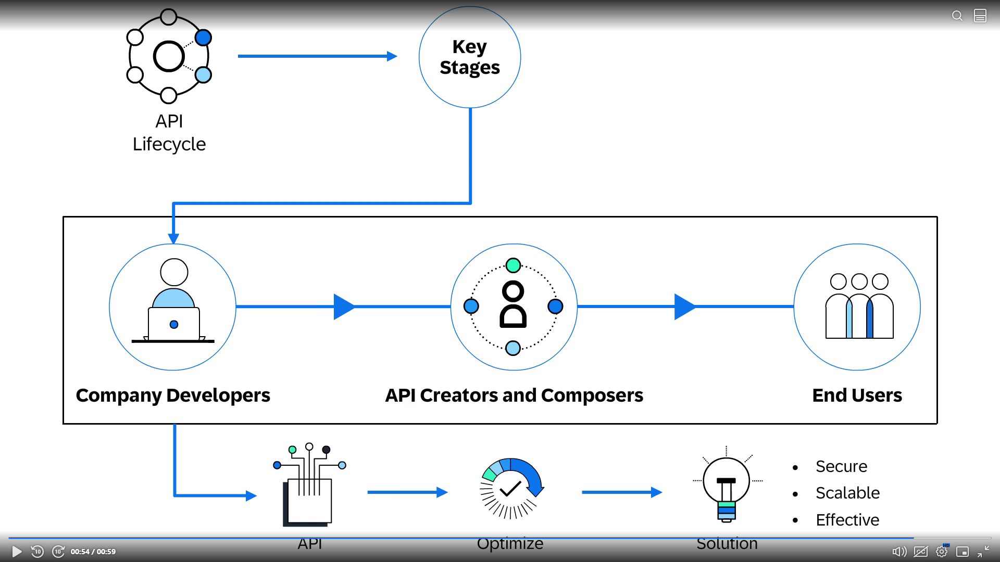
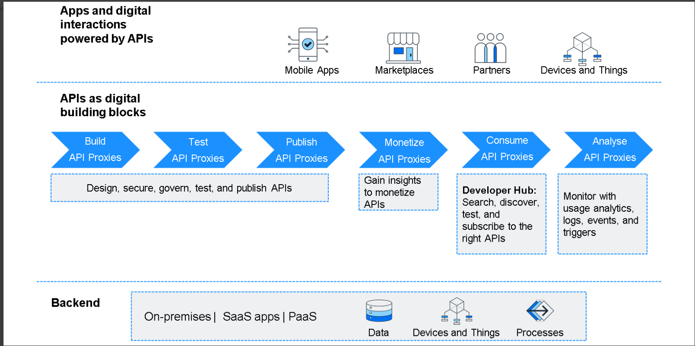

# 🔄 API Lifecycle – Complete Explanation

The **API Lifecycle** describes the full journey of an API from its creation to its consumption and continuous improvement. In SAP API Management, this lifecycle is structured, governed, and optimized through powerful tools and processes.

---



# 👥 Key Stakeholders in the API Lifecycle

## 👨‍💻 Company Developers
- Build backend services or systems.
- Integrate business logic.
- Ensure APIs meet technical requirements.

## 🎨 API Creators & Composers
- Design APIs using standards like OpenAPI.
- Build API proxies.
- Apply security, transformation, and governance policies.
- Ensure APIs meet business goals.

## 🧑‍🤝‍🧑 End Users
- Use applications (mobile, web, devices).
- Consume APIs indirectly through apps.
- Could be employees, customers, or business partners.

---

# 🧩 API Lifecycle Stages
The full lifecycle consists of structured phases that ensure APIs remain secure, scalable, and reliable.


```
Backend → Build → Test → Publish → Monetize → Consume → Analyse
```

---



## 🛠 1️⃣ Build API Proxies
- Create API Proxies using API Portal.
- Connect to backend systems (SAP or non-SAP).
- Protect with authentication (API Key, OAuth, JWT).
- Apply transformation rules (JSON ↔ XML, header modification).
- Add rate limit, quota, and caching.

**Goal:** Transform backend services into secure, managed APIs.

---

## 🧪 2️⃣ Test API Proxies
- Validate functionality.
- Check policy execution.
- Debug errors using trace/debug tools.
- Ensure security policies work.
- Verify performance before publishing.

**Goal:** Make APIs reliable and production-ready.

---

## 📢 3️⃣ Publish API Proxies
- Publish to the **Developer Hub**.
- Add documentation, code samples, metadata.
- Group APIs into **Products** for easy access.

**Goal:** Make APIs discoverable and ready for subscription.

---

## 💰 4️⃣ Monetize API Proxies
- Gain insights on API usage.
- Introduce pricing tiers or usage-based billing.
- Offer premium versions of APIs.
- Enable partner and public developer ecosystems.

**Goal:** Turn APIs into business assets.

---

## 📱 5️⃣ Consume API Proxies
Performed via the **Developer Hub**:
- Developers discover APIs.
- Create Applications.
- Subscribe to Products.
- Retrieve App Keys & Secrets.

Application developers then:
- Integrate APIs into web/mobile/IoT apps.
- Build multi-experience solutions.

**Goal:** Empower developers to build apps powered by APIs.

---

## 📊 6️⃣ Analyse API Proxies
- Monitor API usage and performance.
- Track latency, errors, consumer activity.
- Identify API failures and bottlenecks.
- View logs, events, and traffic patterns.
- Use insights to optimize APIs.

**Goal:** Continuously improve APIs for security, scalability, and efficiency.

---

# 🌐 How SAP Supports the API Lifecycle
SAP API Management enables:
- Discovery and design of APIs.
- Composing and securing APIs.
- Managing policies and lifecycle.
- Publishing to Developer Hub.
- Multi-channel consumption.
- Monitoring for actionable insights.

---

# 🏁 Final Summary
The API lifecycle in SAP API Management ensures:
- APIs are **properly designed**, **secured**, and **optimized**.
- Developers can easily find and use APIs.
- Businesses can leverage APIs for innovation and monetization.
- End users benefit from fast, reliable, multi-experience applications.

This structured approach guarantees APIs deliver **secure**, **scalable**, and **effective** solutions across all business channels.

