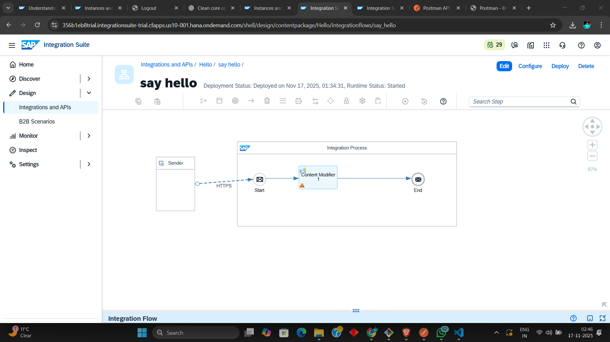

# Hello CPI iFlow — Step-by-step (Design & Deploy)

This file documents the exact steps I followed to create a basic SAP CPI iFlow that sends a "Hello CPI" message using a Content Modifier. Save this `README.md` in the same repository folder as the iFlow and add a screenshot of the graphical iFlow named `iflow-screenshot.png`.

---

## Prerequisites (Basic setup)

1. Create required security keys (if needed) and credentials in **Security Material**.
2. Create required service instances and subscriptions in **SAP BTP / CPI**.
3. Assign required roles to your user (for Design, Monitor, and Deployment access).

---

## Steps I followed (line by line)

1. Open the **SAP CPI** tenant and go to **Design**.
2. Create a new **Package** to hold the iFlow (e.g., `Hello-CPI-Package`).
3. Inside the package, go to **Artifacts** and click **Edit**.
4. Add a new **Integration Flow (iFlow)** to the package.
5. Open the iFlow in the editor (click **Edit** on the iFlow tile).
6. On the canvas, add a **Sender** (Start) and connect it to the flow.
7. Drag a **Content Modifier** step onto the canvas and connect it after the Sender.
8. Open the Content Modifier configuration and choose **Message Body**.
9. Select **Expression / Constant** and enter your message text (e.g., `Hello CPI`).
10. Save the iFlow.
11. Deploy the iFlow (click **Deploy** from the iFlow editor or package view).

---

## How I verified the iFlow (Deployment Check)

1. Go to the **Monitor** tab in CPI.
2. Under **Integration Content** (or Manage Integration Content), find your package and iFlow to check deployment status.
3. If you need to debug issues, enable **Log Configuration** and set the log level to **Trace**.
4. Re-deploy the iFlow. If there are errors, the trace logs will show the error location and details.

---

## How I tested the iFlow using Postman
1. Open **Postman**.
2. Create a new **POST** request.
3. Copy the **Runtime Endpoint URL** of your deployed iFlow from **Monitor → Manage Integration Content**.
4. Go to the **Authorization** tab in Postman.
5. Select **OAuth 2.0 (Client Credentials)** *or* **Basic Auth**, based on your CPI setup.
6. Enter your **Client ID** and **Client Secret** from **BTP → Instances → Service Keys**.
7. Click **Get New Access Token** (for OAuth) or let Postman handle authentication.
8. Send the POST request.
9. You will receive the response defined in your Content Modifier (e.g., `Hello CPI`).

---

##

