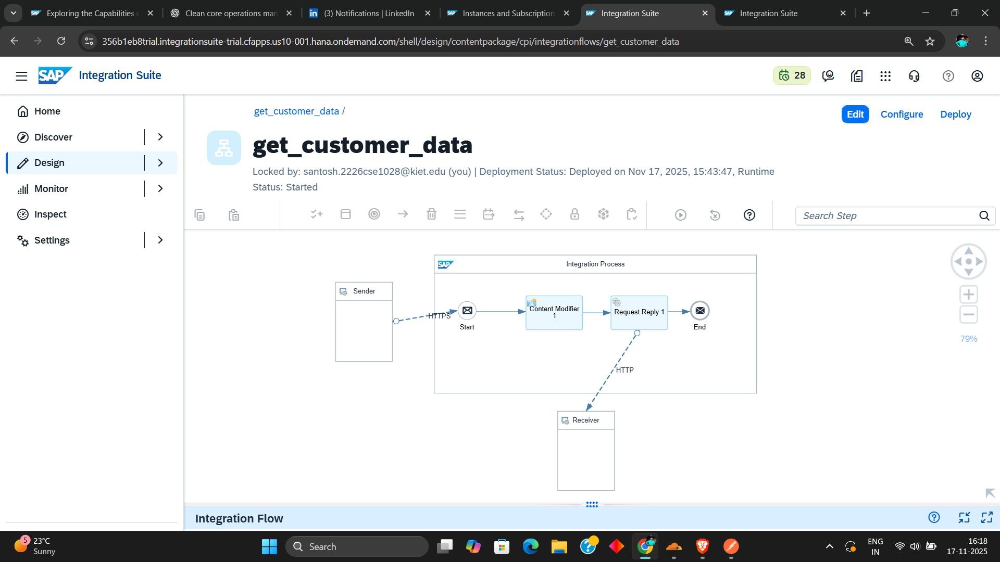

# SAP Integration Suite – Customer Data Fetch Flow

Below is the complete explanation of the HTTP-based Customer Data fetching iFlow using **Content Modifier** and **Request-Reply** steps.

---

## 📌 **Integration Flow Screenshot**

\



---

## 📘 **Steps to Create the ****`get_customer_data`**** iFlow**

### **1. Sender Setup**

- Add an **HTTPS Sender Adapter** to trigger the flow.

---

### **2. Add Content Modifier**

We use the Content Modifier to set **query parameters** and **headers** before calling the external API.

#### **→ Exchange Property**

- **Property Name:** `query`
- **Source Type:** Constant
- **Source Value:**

```
$top=2&$select=CustomerID,CompanyName,Country&$filter=Country eq 'Germany'
```

This builds the OData query string dynamically.

#### **→ Header Setup**

- **Header Name:** `Accept`
- **Source Type:** Constant
- **Source Value:** `application/json`

This ensures the response comes in **JSON format**.

---

### **3. Add Request-Reply Adapter**

This is used to call the external OData service.

#### **Configure HTTP Receiver Adapter**

- **Address:**

```
https://services.odata.org/V2/Northwind/Northwind.svc/Customers
```

- **HTTP Method:** GET
- **Query Parameter:**

```
${property.query}
```

- **Request Headers:** `*`

This means all incoming headers are forwarded.

---

### **4. Connect the Flow**

- Connect **Start → Content Modifier → Request Reply → End**
- Connect the **HTTP Receiver** to the Request-Reply step.

---

### **5. Save & Deploy**

- Once all steps are complete, click **Save**.
- Then click **Deploy** to activate the integration flow.

---

## ✔️ **Final Output**

The deployed iFlow will return filtered JSON customer data from the Northwind OData service.

## **NOTES**

1. In SAP CI, the OData (Open Data Protocol) adapter returns data in XML format by default. However,
when using the HTTP adapter, the response can be returned in JSON format if the
'Content-Type' header is explicitly set to 'application/json'.

2. In SAP CI, one of the advantages of using the HTTP adapter is that it simplifies
troubleshooting. Since the HTTP requests and responses handled by the adapter
can be easily simulated in tools like Postman, you can quickly test and debug
issues locally. If you encounter a problem with a request or payload in your
integration flow, you can replicate the scenario in Postman using the same request
URL and payload. This makes it easier to identify and resolve issues efficiently
within the SAP CL

