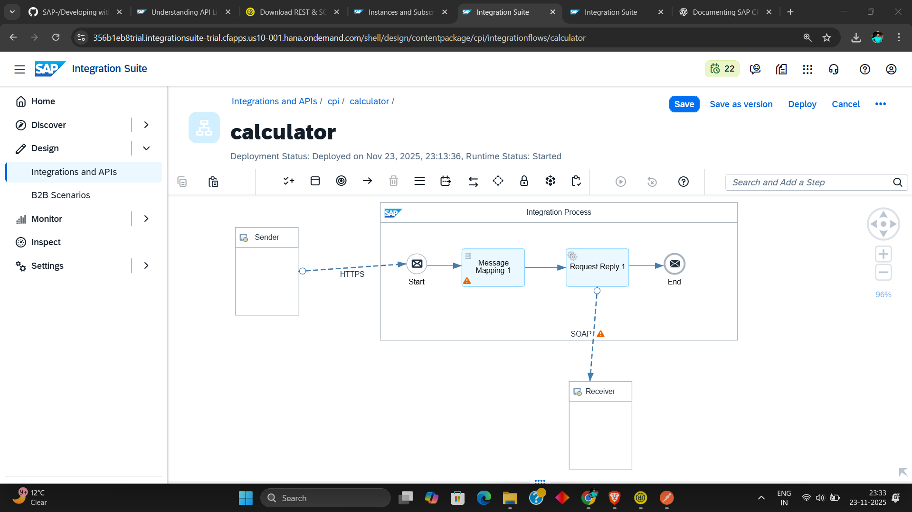

# SAP CPI Calculator .

---

## **Your Steps**

1. **Downloaded WSDL Source**\
   Aapne pehle `http://www.dneonline.com/calculator.asmx?WSDL` file ko download kiya.\
   Fir uske `.xml` file ko rename karke `.wsdl` bana diya.

2. **Opened in SOAP UI**\
   Aapne is WSDL file ko SOAP UI me open kiya.

3. **Created iFlow in SAP CPI**\
   SAP CPI me ek naya iFlow banaya.

4. **Added Message Mapping**\
   iFlow me ek **Message Mapping** add kiya.

5. **Imported WSDL in Mapping**\
   Message Mapping ke andar aapne wahi WSDL file ko **source schema** aur **target schema** dono me upload kiya.

6. **Selected Add Operation**\
   Message Mapping me aapne **Add** wala function choose kiya.

7. **Assigned Constant Values**\
   Target mapping me aapne **variables ko constant values** assign kar di.

8. **Connected Mapping → Request Reply → Receiver**

   - Message Mapping ko **Request-Reply** call se connect kiya.
   - Fir Request-Reply ko **Receiver** adapter se connect kiya.

9. **Configured SOAP Receiver Adapter**\
   Receiver me aapne **SOAP adapter** use kiya.\
   Adapter ke **Address** field me ye URL dala:\
   `http://www.dneonline.com/calculator.asmx`

10. **Selected WSDL Again in Receiver**\
    SOAP Receiver me "URL to WSDL" field me fir se wahi WSDL select ki.

11. **Authentication Set to None**\
    Authentication ko **None** kiya.

12. **Saved & Deployed the iFlow**\
    iFlow ko save karke deploy kar diya.

13. **Tested in Postman**\
    Postman se test karne par CPI **aapke dono constant values ka sum** response me return kar raha hai.

---

