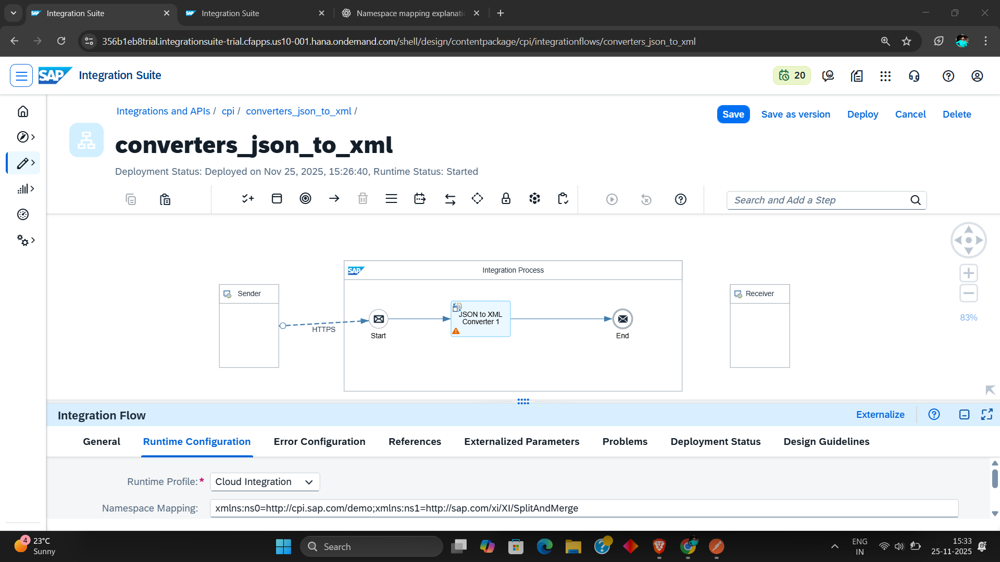

# Convert JSON → XML in SAP CPI (Integration Suite)

**Goal:** Convert incoming JSON to XML with a namespace prefix (e.g. `ns0:MT_Customer`) and produce the exact target XML structure shown below.

> Example namespace mapping used in this doc: `xmlns:ns0=http://cpi.sap.com/demo; xmlns:ns1=http://sap.com/xi/XI/SplitAndMerge`

---

## Table of contents

1. Quick example (source → target)
2. CPI components involved
3. Step-by-step: JSON → XML Converter configuration
4. Namespace mapping: what & where
5. Differences between converters and relevant settings
6. Alternatives (Message Mapping, XSLT)
7. Troubleshooting & tips
8. Full example: payloads and expected output
9. Screenshot (your IFlow)

---

## 1) Quick example (source → target)

**Source JSON**

```json
{
  "row": [
    {
      "CustomerID": "NEWCID1",
      "CompanyName": "NEWCOMPANY1",
      "Country": "France"
    },
    {
      "CustomerID": "NEWCID2",
      "CompanyName": "NEWCOMPANY1",
      "Country": "Italy"
    }
  ]
}
```

**Target XML**

```xml
<?xml version='1.0' encoding='UTF-8'?>
<ns0:MT_Customer xmlns:ns0="http://cpi.sap.com/demo">
    <row>
        <CustomerID>NEWCID1</CustomerID>
        <CompanyName>NEWCOMPANY1</CompanyName>
        <Country>France</Country>
    </row>
    <row>
        <CustomerID>NEWCID2</CustomerID>
        <CompanyName>NEWCOMPANY1</CompanyName>
        <Country>Italy</Country>
    </row>
</ns0:MT_Customer>
```

---

## 2) CPI components involved

- **Start**: HTTP/Adapter receiving JSON
- **JSON to XML Converter** step (built-in CPI converter)
- **Message Mapping** (optional) — if you need structure transformation beyond converter capabilities
- **Content Modifier** (optional) — to add/remove headers or set message body before/after conversion
- **Receiver**: where the XML is sent

---

## 3) Step-by-step: JSON → XML Converter configuration

1. **Add the Converter step** to your IFlow (Search: "JSON to XML Converter").
2. **Runtime Configuration (Integration Flow property)** — set the **Namespace Mapping** at the IFlow level (not inside converter UI):
   - Example entry (single line):
     ```text
     xmlns:ns0=http://cpi.sap.com/demo;xmlns:ns1=http://sap.com/xi/XI/SplitAndMerge
     ```
   - This tells the converter which prefix to use for which namespace URI.
3. **Converter settings (Properties pane of the converter step)**
   - **Root element name**: If you need an enclosing root like `MT_Customer`, either:
     - Set `Root Element Name` in the converter (if available), or
     - Add a `Content Modifier` before/after to wrap the JSON with a root node.
   - **Include XML declaration**: Enable if you want `<?xml version='1.0' ...?>`.
   - **Array handling**: Ensure the converter treats `row` as an array of repeating elements (it usually does by default).
   - **Namespace options**: Most JSON→XML converters rely on the IFlow `Namespace Mapping` (above) to attach prefixes. There is no place in the JSON itself to add prefixes — the mapping is mandatory.
4. **If root element requires a namespace prefix** (e.g. `ns0:MT_Customer`):
   - Use the `Root Element Name` with prefix: `ns0:MT_Customer` (if converter accepts prefix). If it does not accept prefix, leave the root name and rely on Namespace Mapping combined with a small script or Content Modifier to add prefix.
5. **Test the IFlow** with sample JSON and validate the XML output.

---

## 4) Namespace mapping: what & where

- **Why**: JSON does not carry XML namespace info. CPI must be told which prefix maps to which URI.
- **Where to configure**: IFlow `Runtime Configuration` → `Namespace Mapping` (single-line semicolon-separated `prefix=uri` pairs).
  - Example:
    ```text
    xmlns:ns0=http://cpi.sap.com/demo;xmlns:ns1=http://sap.com/xi/XI/SplitAndMerge
    ```
- **How CPI uses it**:
  - When converter creates XML elements, it can prepend `ns0:` to the root or elements that you indicate (via `Root Element Name` or mapping rules) and add the namespace declaration on the element.
- **Important**: `ns0`, `ns1` are **not** CPI defaults — they are defined by you/the WSDL/XSD or the developer. CPI will accept any prefix names you provide (ns0 is a common convention).

---

## 5) Differences between converters and relevant settings

CPI has a few converter options and/or you can use alternate approaches. Key differences and what changes:

### A. Built-in JSON → XML Converter (standard)

- **What it does**: Translates JSON object keys to XML elements.
- **Namespace handling**: Depends on IFlow `Namespace Mapping` and converter `Root Element Name`. Converter itself does not invent prefixes.
- **Array handling**: JSON arrays are converted to repeating XML elements.
- **Good for**: Straightforward structure-preserving conversions.

### B. XML → JSON Converter (reverse direction)

- **Important**: This strips prefixes/namespaces unless configured; the reverse mapping may lose prefix information unless you explicitly map.

### C. Custom XSLT or Message Mapping (Graphical/Java/Your XSLT)

- **What changes**: You have full control of prefixes, attributes, nested structures, and conditional logic.
- **When to use**: Complex transformations, strict target XSD compliance, or when converter cannot create the exact XML shape.

### D. Groovy Script or Java Mapping

- **What changes**: You control exact string output (you can create XML via DOM or text). Use when converter options are insufficient.

### E. Content Modifier + Converter combo

- **Common pattern**: Wrap JSON with an artificial root, set headers for namespace, then run Converter.
- **What changes**: Adds ability to set `ns0:Root` as root and attach namespace declarations without custom XSLT.

---

## 6) Alternatives (Message Mapping, XSLT)

- **Graphical Message Mapping**: Map source to target structure; add namespace on target root. Good if you have WSDL/XSD on the receiver side.
- **XSLT**: Transform a previously converted XML (or build XML directly from JSON converted into a predictable XML) to the exact final structure and add namespace declarations explicitly.

**Recommendation**: Use the built-in JSON→XML converter for simple structure conversions. For strict XSD compliance (namespaces, root prefix, attributes), use Message Mapping or XSLT.

---

## 7) Troubleshooting & tips

- If your XML **does not include the prefix**:
  - Check Runtime Namespace Mapping in the IFlow.
  - Verify the `Root Element Name` includes the prefix (or add the prefix later using Content Modifier/XSLT).
- If receiver **rejects** the XML:
  - Validate against the receiver XSD/WSDL.
  - Confirm exact prefix and URI match expected values.
- If arrays become wrapped incorrectly:
  - Use a test payload and inspect intermediate message in CPI trace.
- Use simple test flows: HTTP sender → Converter → Trace → End. This isolates converter behavior.

---

## 8) Full working example (recommended approach)

**Approach A — Simple**

1. In IFlow Runtime Configuration add:
   ```text
   xmlns:ns0=http://cpi.sap.com/demo
   ```
2. JSON to XML Converter properties:
   - Root element name: `ns0:MT_Customer` (if supported)
   - Include XML declaration: yes
3. Send the JSON above. Output should match the target XML.

**Approach B — If converter refuses prefix on root**

1. Set runtime namespace mapping as above.
2. Set converter root as `MT_Customer` (no prefix).
3. Add **Content Modifier (after Converter)** with header `CamelHttpResponse` (or simple groovy) to rename the root to `ns0:MT_Customer` and add `xmlns:ns0` declaration, or run a small Groovy script to insert the namespace declaration.

**Approach C — Using XSLT (most robust)**

1. Convert JSON→XML with a neutral root (e.g. `MT_Customer`).
2. Apply XSLT to add `ns0:` prefix and namespace declaration exactly as required.

---

## 9) Screenshot (your IFlow)




---

### Quick checklist before testing

- Namespace Mapping configured in **Runtime Configuration** (IFlow). ✅
- Converter root element name set (or plan to set prefix via Content Modifier/XSLT). ✅
- Test with Trace enabled so you can inspect intermediate XML. ✅


